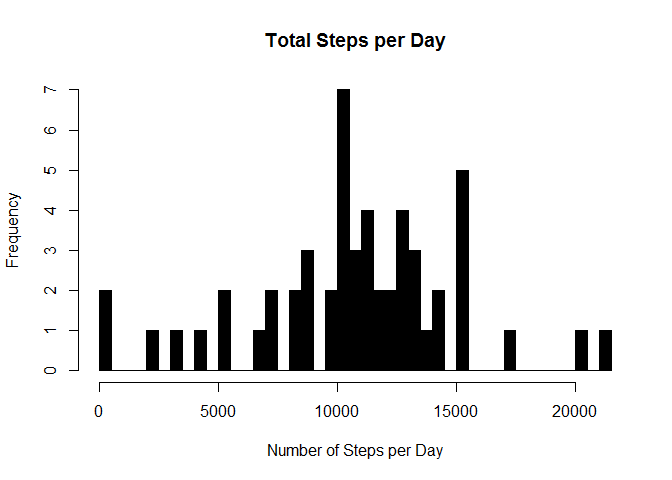
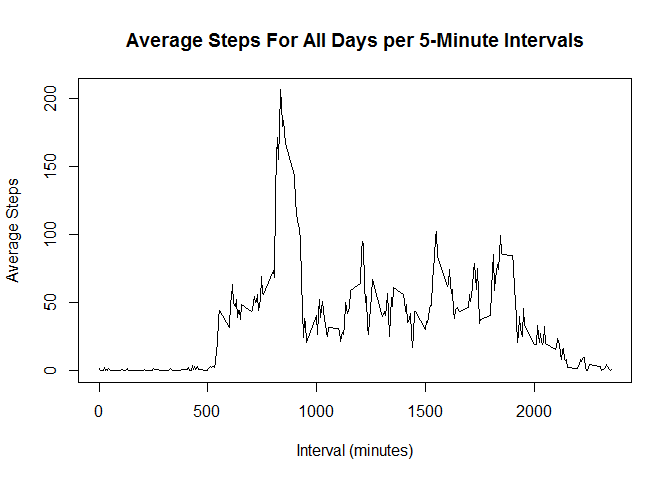
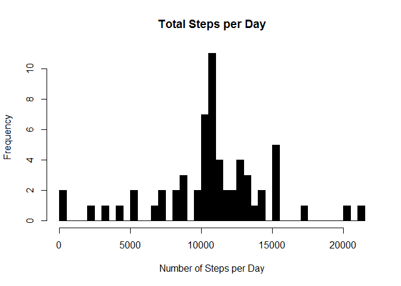
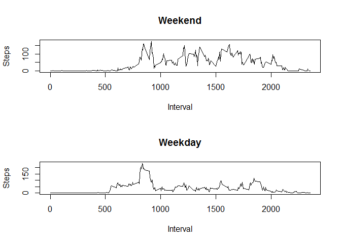

# Reproducible Research: Peer Assessment 1

This project was done with the activity.csv forked from [Roger D. Peng's Github repository](https://github.com/rdpeng/RepData_PeerAssessment1) with the file unzipped in the working directory.

This task aims to answer five basic questions using R for data analysis and then compiling the process into this markdown document.
The steps are presented below in the order in which they were asked in the pdf found [here](https://github.com/rdpeng/RepData_PeerAssessment1/blob/master/doc/instructions.pdf). 

### Loading and preprocessing the data

##### 1. Load the data.

##### 2. Process/transform the data (if necessary) into a format suitable for your analysis.

First we read in the activity data and view it's class information.


```r
setwd("~/GitHub/RepData_PeerAssessment1/activity")
activity <- read.csv("activity.csv")
str(activity)
```

```
## 'data.frame':	17568 obs. of  3 variables:
##  $ steps   : int  NA NA NA NA NA NA NA NA NA NA ...
##  $ date    : Factor w/ 61 levels "2012-10-01","2012-10-02",..: 1 1 1 1 1 1 1 1 1 1 ...
##  $ interval: int  0 5 10 15 20 25 30 35 40 45 ...
```

From the summary we can see that steps and interval are both intigers which will work for this analysis, but date is a Factor which will prevent appropriate plotting. To alter this, we will coerce it into a date/time class using as.date.


```r
activity2 <- as.Date(activity$date, format = "%Y-%m-%d")
```

We then must take the old Date column and replace it with the new information utilizing the dplyr package, as well as tidy up the naming of the columns.


```r
library(plyr)
library(dplyr)
```

```
## 
## Attaching package: 'dplyr'
## 
## The following objects are masked from 'package:plyr':
## 
##     arrange, count, desc, failwith, id, mutate, rename, summarise,
##     summarize
## 
## The following objects are masked from 'package:stats':
## 
##     filter, lag
## 
## The following objects are masked from 'package:base':
## 
##     intersect, setdiff, setequal, union
```

```r
activity2 <- data.frame(activity2)
activity <- cbind(activity, activity2)
activity <- select(activity, steps, activity2, interval)
colnames(activity)[colnames(activity)=="activity2"] <- "Date"
colnames(activity)[colnames(activity)=="steps"] <- "Steps"
colnames(activity)[colnames(activity)=="interval"] <- "Interval"
str(activity)
```

```
## 'data.frame':	17568 obs. of  3 variables:
##  $ Steps   : int  NA NA NA NA NA NA NA NA NA NA ...
##  $ Date    : Date, format: "2012-10-01" "2012-10-01" ...
##  $ Interval: int  0 5 10 15 20 25 30 35 40 45 ...
```

### What is mean total number of steps taken per day?

##### 1. Calculate the total number of steps taken per day.

##### 2. Make a histogram of the total number of steps taken each day.

##### 3. Calculate and report the mean and median of the total number of steps taken per day.

First the steps taken per day must be calculated.


```r
steps1 <- aggregate(activity$Steps ~ activity$Date, na.omit = TRUE, FUN = sum)
names(steps1) <- c("Date", "Steps")
```

Next we produce the histogram for the steps taken per day in steps1 after finding out how many rows are in steps1.


```r
length(steps1$Steps)
```

```
## [1] 53
```

```r
hist(steps1$Steps, col = "black", xlab = "Number of Steps per Day", main = "Total Steps per Day", breaks = 53)
```

 

We then calculate the mean and median of the total number of steps.


```r
mean1 <- mean(steps1$Steps)
median1 <- median(steps1$Steps)
mean1
```

```
## [1] 10767.19
```

```r
median1
```

```
## [1] 10766
```

### What is the average daily activity pattern?

##### 1. Make a time series plot of the 5-minute interval (x-axis) and the average number of steps taken, averaged across all days.

##### 2. Which 5-minute interval, on average across all the days in the dataset, contains the maximum number of steps?

First the average (mean) number of steps for each of the time intervals is calculated and cleaned. Then the data is plotted using the plot() function and appropriate parameters.


```r
intervalmean <- aggregate(activity$Steps ~ activity$Interval, na.omit = TRUE, FUN = mean)
names(intervalmean) <- c("Interval", "Average_Steps")

## Plot the Interval v. Average Steps

plot(intervalmean$Interval, intervalmean$Average_Steps, type="l", xlab = "Interval (minutes)", ylab = "Average Steps", main = "Average Steps For All Days per 5-Minute Intervals")
```

 

Then the maximum step count interval is calculated using which.max.


```r
intervalmean$Interval[which.max(intervalmean$Average_Steps)]
```

```
## [1] 835
```

### Imputing missing values

##### 1. Calculate and report the total number of missing values in the dataset.

##### 2. Devise a strategy for filling in all of the missing values in the dataset. The strategy does not need to be sophisticated. For example, you could use the mean/median for that day, or the mean for that 5-minute interval, etc.

##### 3. Create a new dataset that is equal to the original dataset but with the missing data filled in.

##### 4. Make a histogram of the total number of steps taken each day and Calculate and report the mean and median total number of steps taken per day. Do these values differ from the estimates from the first part of the assignment? What is the impact of imputing missing data on the estimates of the total daily number of steps?

Initially the na count is measured using the sum function.


```r
nacount <- sum(is.na(activity$Steps))
nacount
```

```
## [1] 2304
```

We then read activity into a new data frame and substitute the averages (means) of the intervals for the NA values by reading a list of the na locations and correlating it to the activityna dataframe.


```r
activityna <- activity

## Replace the NAs in the activityna1 dataframe

nareplace <- data.frame(Date=activityna$Date[is.na(activityna$Steps)], Interval = activityna$Interval[is.na(activityna$Steps)], Steps=intervalmean[match(intervalmean$Interval, activityna$Interval[is.na(activityna$Steps)]),2])
View(head(nareplace))
```

Next the mean and median of the new dataset must be calculated as in part 2 after adding the means for the intervals back in to activityna using rbind


```r
activityna <- subset(activityna, !is.na(activityna$Steps))
activityna <- rbind(activityna, nareplace)
aggsteps <- aggregate(activityna$Steps ~activityna$Date, FUN = sum, na.rm = TRUE)
names(aggsteps) <- c("Date", "Steps")

## Then the mean and median are calculated.

mean2 <- mean(aggsteps$Steps)
median2 <- median(aggsteps$Steps)
mean2
```

```
## [1] 10766.19
```

```r
median2
```

```
## [1] 10766.19
```

```r
mean1-mean2
```

```
## [1] 1
```

```r
median1-median2
```

```
## [1] -0.1886792
```

There is practically no difference between the original data set and the adjusted data set with the means added in for the NA values.


```r
hist(aggsteps$Steps, col = "black", xlab = "Number of Steps per Day", main = "Total Steps per Day", breaks = 53)
```

 

While the histogram does show a difference in the distribution, we know from the mean and median calculations that overall this variation does not greatly impact the averags.

### Are there differences in activity patterns between weekdays and weekends?

##### 1. Create a new factor variable in the dataset with two levels - "weekday" and "weekend" indicating whether a given date is a weekday or weekend day.
##### 2. Make a panel plot containing a time series plot of the 5-minute interval and the average number of steps taken, averaged across all weekday days or weekend days.

First we create the two-level factor variable that splits the dates based on whether they were during the week or the weekend through a function.


```r
DOW <- function(DOW){
    if (weekdays(as.Date(DOW)) %in% c("Saturday", "Sunday"))
    {"Weekend"} else {"Weekday"}
}

## Then the function is applied to the data in the activity dataframe.

activity[, 4] <- as.factor(sapply(activity$Date, DOW))
colnames(activity)[colnames(activity)=="V4"] <- "Weekend_or_Weekday"
View(head(activity))
```

Finally, we make 2 plots comparing the average steps taken in the 5-minute intervals based on whether they were taken during the weekend or on a weekday.


```r
par(mfrow = c(2,1))
for (type in c("Weekend", "Weekday")){
    DOWsteps <- aggregate(Steps ~ Interval, data = activity, subset = activity$Weekend_or_Weekday == type, FUN = mean)
    plot(DOWsteps, type = "l", main = type)
}
```

 

As we can see from the graphs, the subject is much more active during the weekend compared to weekdays, with a noticeable exception being from 0 to 500 on the intervals, as well at the peak aroun 850 and the tail that smooths off past 2000.
